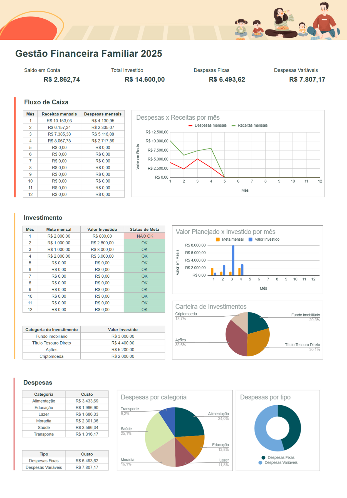

# Financas Pessoais

Como você organiza suas finanças pessoais?

Estive pensando em como unir um problema cotidiano a uma solução usando Google Sheets. Foi assim que surgiu a ideia deste projeto voltado para gestão financeira pessoal, um tema importante mas muitas vezes negligenciado.

Muita gente diz:
 “Mas eu não ganho o suficiente para investir, nunca sobra dinheiro.”
A questão é: você realmente acompanha seus gastos? Já parou para analisar onde seu dinheiro está indo? Será que existem despesas que podem ser reduzidas? E aquela meta de ano novo para economizar está sendo colocada em prática?

O projeto é dividido em duas planilhas:
Uma para lançamento de dados financeiros;
Outra com um dashboard visual para análise dos resultados.

Usei apenas funções básicas como SOMASES, formatação condicional e gráficos, é um projeto simples. A ideia é mostrar que, com um pouco de organização e visualização clara dos dados, é possível transformar a forma como lidamos com o nosso dinheiro.

Aviso: Estes são dados fictícios gerados por IA.

## Tecnologias Utilizadas
- **Google Sheets** (Visualização de dados)

## Estrutura de pastas
- **visualizacoes/**  Guarda gráficos e dashboards gerados.
- **dados/**  Planilha criada em xlsx
